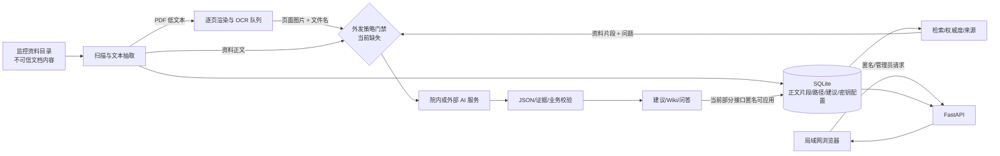

# OA 项目管理系统代码审计报告

> 审计日期：2026-09-01  
> 审计对象：`oa-project-management-system`  
> 审计基线：`ae7603516c69ba1bb0f547c72c2e26fe7f44c7da`（`master`）  
> 报告范围：代码质量、安全、可靠性、数据治理、测试、部署运维  
> 结论口径：需求稿仅用于理解数据敏感度、局域网部署和项目管理场景，不用于判定完整 OA 功能符合性。

## 1. 执行摘要

本系统已经形成可运行的“项目资料扫描、抽取/OCR、SQLite 索引、AI 建议、Wiki、问答及项目跟踪”闭环，前端可构建，现有后端测试全部通过；代码中也能看到参数化 SQL、外键启用、口令哈希、来源证据、文档权威度和人工审核建议等积极设计。

但以“院内局域网、项目资料可能包含合同/人员/实施信息、允许接入外部模型”的实际使用背景衡量，当前版本不宜直接作为多人共享服务上线。核心原因是：普通业务接口没有身份认证和授权，任意能访问端口的客户端可读取资料正文、路径和项目数据并执行写操作；宽泛 CORS 又把这一边界扩大到浏览器跨站请求。同时，“允许发送内容到外部模型服务”开关没有进入任何调用前的强制判定，存在界面承诺与实际行为不一致。另有启动初始化覆盖用户里程碑、默认 `admin/admin`、密码修改后旧会话继续有效、公开同步扫描及 OCR 无页数上限等高风险问题。

综合评级：**高风险，建议完成 0–2 天阶段的阻断项后再允许局域网多人访问。**

### 1.1 质量评分卡

评分采用 1–5 分，5 分为可在目标场景中稳健运营。

| 维度 | 得分 | 判断 |
|---|---:|---|
| 安全 | 1.5/5 | 管理接口有认证，但 27 个 API 路由及 SPA 入口公开，公开面包含敏感读取与写操作；认证策略也偏弱。 |
| 可靠性 | 2.0/5 | SQLite 基础约束与事务已使用，但长事务、5 秒锁等待、启动覆盖数据和进程内任务状态会影响稳定性。 |
| 数据治理 | 2.0/5 | 有来源、权威度、证据和治理建议机制；外发同意开关、提示注入隔离、密钥存储和备份恢复尚未闭环。 |
| 可维护性 | 2.0/5 | 领域代码已有服务划分，但多个 900–3,000 行单文件、API/模型混杂、宽泛异常处理增加变更风险。 |
| 测试 | 1.5/5 | 11 个现有用例通过，但总覆盖率仅 18%，认证、API、扫描、AI/OCR 和迁移缺少回归保护。 |
| 部署运维 | 1.5/5 | 有一键启动脚本，但每次启动联网安装/构建、明文 HTTP 绑定全网卡、无就绪检查、备份恢复和持久任务。 |
| **综合** | **1.8/5** | **可用于受控单机试验；完成高风险修复前，不建议作为共享局域网服务。** |

### 1.2 问题总览

| 编号 | 严重性 | 类型 | 标题 | 建议时限 |
|---|---|---|---|---|
| A-01 | 高 | 明确缺陷 | 大量业务接口匿名可读写，且 CORS 允许任意来源 | 立即 |
| A-02 | 高 | 明确缺陷 | “允许发送到外部模型”开关不生效 | 立即 |
| A-03 | 高 | 明确缺陷 | 每次启动会覆盖匹配标题的里程碑人工数据 | 立即 |
| A-04 | 高 | 明确缺陷 | 默认管理员口令弱，缺少限速/锁定，改密不吊销旧会话 | 立即 |
| A-05 | 高 | 架构风险 | 匿名同步扫描可触发全目录处理，OCR 无页数/总量上限 | 立即 |
| B-01 | 中 | 明确缺陷 | 任务写接口缺少字段约束，更新不存在记录仍返回成功 | 1 周内 |
| B-02 | 中 | 架构风险 | SQLite 默认回滚日志与长事务导致写锁超时和 500 | 1–2 周 |
| B-03 | 中 | 架构风险 | Schema 迁移无版本账本、回滚与启动前备份 | 1–2 周 |
| B-04 | 中 | 明确缺陷 | 启动异常被吞掉，健康检查始终返回正常 | 1 周内 |
| B-05 | 中 | 架构风险 | 后台任务状态仅在单进程内存，守护线程不可恢复 | 1–2 周 |
| B-06 | 中 | 明确缺陷 | 前后端锁定依赖存在已知安全公告 | 立即评估，1 周内升级 |
| B-07 | 中 | 架构风险 | API Key 与完整智能分析配置以明文存入 SQLite | 1–2 周 |
| B-08 | 中 | 架构风险 | 文档内容直接进入模型提示，缺少系统化提示注入防护 | 1–2 周 |
| B-09 | 中 | 架构风险 | 关键路径测试缺失，总覆盖率 18%，无 CI 质量门禁 | 1–2 周 |
| B-10 | 中 | 架构风险 | 超大前后端模块及高频轮询抬高维护与运行成本 | 1–2 月 |
| C-01 | 低 | 可选优化 | 启动过程不可复现且默认以 HTTP 暴露全网卡 | 随部署治理 |
| C-02 | 低 | 可选优化 | 缺少统一日志、错误码、请求关联 ID 与审计日志 | 随运维治理 |

## 2. 审计范围与方法

### 2.1 已覆盖对象

- 全部 Git 跟踪的一方源码与配置：13 个后端 Python 模块、前端入口和样式、依赖清单/锁文件、`start.ps1`、README 和项目内治理文档。
- `backend/app/main.py` 中 59 个路由声明（31 个管理员路由、27 个匿名 API 路由、1 个公开 SPA 回退路由）。
- SQLite 23 个业务/虚拟逻辑表及 5 个 FTS5 影子表；19 条外键关系、14 个显式索引；启动建表、增列和种子更新逻辑。
- 文档发现、文本抽取、PDF OCR、知识索引、AI 抽取、来源权威度、Wiki、问答、数据质量和周报导出链路。
- 最近 Git 记录、启动方式、依赖固定、现有测试和静态检查结果。

逻辑表包括：`system_settings`、`project_profile`、`documents`、`weekly_reports`、`meetings`、`tasks`、`milestones`、`risks`、`change_requests`、`update_suggestions`、`suggestion_sources`、`deliverables`、`knowledge_chunks`、`knowledge_vectors`、`ocr_pages`、`wiki_pages`、`wiki_suggestions`、`document_authority_suggestions`、`project_entities`、`entity_evidence`、`data_quality_suggestions`、`data_quality_actions`，以及 FTS5 虚拟表 `knowledge_chunks_fts`。

### 2.2 动态验证边界

动态验证在系统临时目录中的仓库副本和数据库副本完成：监控目录改为仅包含合成资料的临时目录，AI 配置关闭，OCR 队列清空；涉及 AI 开关的验证采用网络函数替身，仅记录“是否试图调用”，没有发起外部网络请求。另建全新临时数据库验证默认口令和启动种子行为。原数据库、原资料及业务源码未被测试过程修改。

完整性复核时发现，原仓库有一个从 2026-09-01 10:04 起运行的 Uvicorn 进程绑定 `0.0.0.0:8010`，文件监听/扫描仍会持续写入原数据库；因此原数据库在审计开始与结束时的二进制哈希不同，且在连续两次只读哈希计算之间仍发生变化。审计没有停止该活动服务，也没有用旧副本覆盖活动数据库。该变化不是隔离测试产生，但意味着“原数据库审计期内保持逐字节不变”这一验收项受活动进程影响，无法成立；需求稿哈希保持不变，Git 工作树除本报告外没有新增或修改项。

### 2.3 风险定义

- **明确缺陷**：可由代码路径或隔离复现证明当前行为与安全/数据正确性预期冲突。
- **架构风险**：当前可能正常，但在多人、并发、故障、恶意资料或运维切换场景下缺乏边界。
- **可选优化**：不直接造成当前故障，但会明显改善可部署性、可观察性或长期维护成本。

## 3. 高风险问题

### A-01 大量业务接口匿名可读写，且 CORS 允许任意来源

- **类型/严重性**：明确缺陷 / 高
- **影响**：任何能访问 `8010` 端口的客户端均可读取任务、风险、会议、文档列表、文件正文预览、OCR 页、来源证据、周报等；还可创建/修改任务、修改交付物、应用或驳回建议、触发扫描。文档记录包含本机绝对路径、抽取/AI/OCR 状态及错误字段。浏览器还可从任意站点发起跨域请求，增加误点击或恶意页面利用面。
- **证据**：`backend/app/main.py:75-81` 配置 `allow_origins=["*"]`、凭据和全部方法/请求头；`backend/app/main.py:244-246` 的扫描、`404-409` 的问答、`457-464` 的来源、`520` 起的仪表盘、`642-760` 的任务读写、`847-849` 的文档、`879-908` 的交付物修改、`913-939` 的全文预览、`942-962` 的建议写操作、`965-977` 的周报均无 `admin_from_request` 依赖。
- **隔离复现**：无 Cookie 请求 `GET /api/documents`、`GET /api/documents/{id}/preview`、`POST /api/tasks`、`PATCH /api/tasks/{id}`、`POST /api/suggestions/{id}/dismiss` 均返回 200；预览响应含正文和绝对路径。`Origin: https://evil.example` 的写请求得到 `Access-Control-Allow-Origin: *`，预检响应回显该恶意来源并允许凭据。
- **适用场景**：单机仅回环地址且由唯一可信用户使用时风险降低；一旦按当前脚本绑定 `0.0.0.0`、多人共享或端口可被其他终端访问，风险成立。
- **修复建议**：建立最小角色模型（至少 viewer/editor/admin），默认所有 `/api/**` 要求登录；对扫描、建议应用、任务/交付物写操作执行 CSRF/Origin 校验和审计记录；仅允许配置的同源地址，若前后端同源则移除 CORS；响应 DTO 排除 `path`、原始模型响应和内部错误。
- **预计工作量**：2–4 人日；如接入单位统一身份认证，另行估算。
- **置信度**：高。

### A-02 “允许发送内容到外部模型服务”开关不生效

- **类型/严重性**：明确缺陷 / 高
- **影响**：管理员在界面关闭外部发送后，只要 AI `enabled` 且配置了地址，文本抽取、问答或 OCR 仍会调用所配置的模型端点，可能造成资料越界外发，与界面提示和保密预期不一致。
- **证据**：前端明确显示开关，见 `frontend/src/main.jsx:2295-2302`；后端仅归一化并保存该值，见 `backend/app/main.py:126-143` 和 `backend/app/database.py:38-44`。文档分析仅判断 `enabled`，见 `backend/app/services/scanner.py:592-620`；聊天调用在 `backend/app/services/ai.py:227-252` 仅检查 API 地址/模型；OCR 在 `backend/app/services/ocr.py:130-156` 同样未检查 `allowExternalService`。
- **隔离复现**：以 `allowExternalService=false` 调用 `chat_completion`，将网络函数替换为本地探针；探针仍收到对 `/chat/completions` 的调用，证明调用前没有门禁。测试未访问网络。
- **适用场景**：模型端点完全位于经批准的院内网络时，“外部”定义可能不同，但开关语义仍然失真，应改为明确的端点信任策略。
- **修复建议**：在唯一出口函数 `_post_json`/模型客户端之前做不可绕过的策略判定；维护允许域名/IP、协议、用途（聊天/Embedding/OCR）和资料等级白名单；默认拒绝，记录脱敏审计事件；界面保存后立即做无敏感内容的策略自检。同步让 `reviewPolicy`、`reviewOnly`、`autoApplyLowRisk` 成为服务端真实策略，而非仅派生配置。
- **预计工作量**：1–2 人日；若引入资料分级和审批流，约 1–2 周。
- **置信度**：高。

### A-03 每次启动会覆盖匹配标题的里程碑人工数据

- **类型/严重性**：明确缺陷 / 高
- **影响**：用户对预置里程碑的状态、实际日期、计划日期、说明和颜色所做的更新，会在应用重启时被源码内默认值覆盖；项目进展数据可能倒退且无审计痕迹。
- **证据**：`backend/app/database.py:1147-1153` 只对计划设置做版本判断，但 `1155-1201` 每次都按标题查找并执行 `UPDATE milestones`，覆盖 `description`、`planned_date`、`actual_date`、`status`、`color_status`；项目简介和目标日期也在 `1164-1177` 每次覆盖。
- **隔离复现**：在全新临时库执行初始化，将一个预置里程碑改为 `delayed` 并写入实际日期，再次执行 `init_db()`；状态恢复为 `planned`，实际日期被清空。
- **适用场景**：仅影响标题与源码预置项相同的里程碑/固定项目档案；这些恰是系统主要计划基线，因此影响概率高。
- **修复建议**：将“建表迁移”“首次种子”“业务数据升级”分离；种子只 `INSERT` 缺失项，业务基线变更必须用带版本、前置条件、备份和审计记录的显式迁移；不要用可编辑标题作为自然主键。
- **预计工作量**：1–2 人日，另加历史数据核验 0.5–1 人日。
- **置信度**：高。

### A-04 默认管理员口令弱，缺少限速/锁定，改密不吊销旧会话

- **类型/严重性**：明确缺陷 / 高
- **影响**：新部署可用公开默认凭据登录；密码最低仅 4 位；暴力尝试没有限速；修改密码后已泄露的 12 小时会话仍有效。Cookie 没有 `Secure`，配合 HTTP 局域网部署时可能被同网段窃取。
- **证据**：`backend/app/auth.py:16-19` 固定 `admin/admin` 和 12 小时 TTL，`57-61` 首次写入默认口令及会话密钥，`87-95` 仅要求 4 位并只更换密码哈希；令牌签名仅依赖不随改密轮换的会话密钥，见 `107-136`。Cookie 设置在 `backend/app/main.py:184-195`，只有 `HttpOnly`、`SameSite=Lax`，无 `Secure`。
- **隔离复现**：全新临时库首次登录 `admin/admin` 返回 200；连续 8 次错误登录均为 401、无延迟或锁定；4 字符新密码被接受；改密前的旧 Cookie 随后访问管理员设置仍返回 200。
- **适用场景**：所有新部署、备份恢复、测试环境克隆及管理员会话泄露场景。
- **修复建议**：首次启动生成一次性高熵口令或强制初始化流程，未改密前禁止其他功能；最低 12 位并支持口令短语；账户+IP 组合限速、指数退避和审计；会话加入服务端 `session_version`/会话表，改密和退出时吊销；生产 Cookie 设 `Secure`，全链路 HTTPS。
- **预计工作量**：1–2 人日。
- **置信度**：高。

### A-05 匿名同步扫描可触发全目录处理，OCR 无页数/总量上限

- **类型/严重性**：架构风险 / 高
- **影响**：公开 `POST /api/scan` 会同步遍历配置目录并顺序处理全部文件，可占用请求线程、CPU、内存和 SQLite 写锁；低文本 PDF 会进入 OCR，按实际总页数建队列并逐页渲染、Base64 编码和发送模型，缺少单文件页数、像素、队列总量、速率和费用上限。攻击者或误操作可造成拒绝服务或大量资料外发。
- **证据**：公开路由见 `backend/app/main.py:244-246`；扫描采用列表推导顺序执行全部文件，见 `backend/app/services/scanner.py:783-795`；普通 PDF 文本抽取虽限制 15 MiB/12 页，见 `backend/app/services/extractors.py:16-17,203-213`，但 OCR 判定仅看后缀和文本长度，见 `backend/app/services/ocr.py:54-60`，随后对 `1..total` 每页建队列，见 `63-89`，并逐页渲染/模型调用，见 `122-156,244-269`。
- **复现方式**：代码路径确认；本次没有构造超大 PDF 或实际模型调用，以避免资源消耗和数据外发。
- **适用场景**：扫描目录可写入大文件、历史扫描件较多、多人重复触发扫描或模型按量计费时。
- **修复建议**：扫描只允许管理员且转为持久队列；增加幂等键、单实例互斥、取消、超时、背压；限制文件大小、PDF 页数、渲染像素、单日页数/费用和目录总量；OCR 前再次执行外发策略与资料分级判定；返回 202 + 任务 ID，不在请求中同步完成。
- **预计工作量**：3–5 人日。
- **置信度**：高。

## 4. 中风险问题

### B-01 任务写接口缺少字段约束，更新不存在记录仍返回成功

- **类型**：明确缺陷。
- **影响**：空标题、任意状态、负数或大于 100 的进度可入库，破坏统计、甘特图和数据治理；调用方无法区分“已更新”和“记录不存在”。
- **证据**：`TaskPayload` 仅声明基础类型，无长度/枚举/范围约束，见 `backend/app/main.py:101-110`；通用 Patch 接受 `dict[str, Any]`，见 `113-119`；任务写入未经业务校验，见 `668-698`；更新路径没有检查 `rowcount`，见 `725-757`。
- **隔离复现**：匿名创建/更新后，数据库存有空标题、`bad_status`、`progress=-50`；更新不存在的 ID 仍返回 200。
- **建议/工作量/置信度**：使用 Pydantic 枚举、`min_length`、`ge/le` 和日期交叉校验；Patch 为每资源建立明确模型；未命中返回 404；数据库增加 `CHECK`。1–2 人日，高。

### B-02 SQLite 默认回滚日志与长事务导致写锁超时和 500

- **类型**：架构风险。
- **影响**：扫描、抽取、知识索引、权限分析和 AI 调用在一次事务中进行时，会长期占有写事务；并发编辑可能等待默认 5 秒后得到未处理的 500。
- **证据**：连接只显式启用外键，见 `backend/app/database.py:348-351`；隔离库为 `journal_mode=delete`、`busy_timeout=5000`。`index_document` 在单连接上执行多项处理和可能的 AI 调用，直到 `backend/app/services/scanner.py:740-780` 才提交/回滚；同步扫描逐文件串行，见 `783-795`。
- **隔离复现**：在数据库副本持有 `BEGIN IMMEDIATE` 写锁，同时创建任务；请求约 5.56 秒后返回 500 `Internal Server Error`。
- **建议/工作量/置信度**：缩短事务，模型/文件 I/O 在事务外执行并以状态机提交；评估 WAL、合理 busy timeout 和锁重试；统一映射为 409/503；若预计多用户高写并发，迁移 PostgreSQL。3–5 人日，高。

### B-03 Schema 迁移无版本账本、回滚与启动前备份

- **类型**：架构风险。
- **影响**：建表、动态增列、FTS 重建、种子更新和业务数据修订都由启动函数执行；中途失败难以判定已完成版本，也没有自动备份和回滚点，升级/降级兼容性不可证明。
- **证据**：`backend/app/database.py:391-1017` 集中建表和 `PRAGMA table_info`/`ALTER TABLE`；数据库 `PRAGMA user_version=0`，未发现迁移账本；项目内未发现数据库备份/恢复实现。
- **建议/工作量/置信度**：引入显式迁移工具或最小 `schema_migrations` 表；每个迁移单事务、可重复、带前置/后置校验；启动前做 SQLite 在线备份并演练恢复；CI 覆盖空库、上一版本库、故障中断和回滚。3–5 人日，高。

### B-04 启动异常被吞掉，健康检查始终返回正常

- **类型**：明确缺陷。
- **影响**：实体引导、首次扫描、文件监听或 OCR worker 启动失败时无日志、无告警，服务仍报告 `ok=true`，运维会误判可用。
- **证据**：`backend/app/main.py:147-166` 四段 `except Exception: pass`；`174-176` 健康检查不验证数据库、工作线程、扫描目录或迁移状态。
- **建议/工作量/置信度**：关键初始化失败应阻止就绪；区分 liveness/readiness；结构化记录堆栈、组件状态和最后成功时间；非关键组件降级时在 readiness/管理页明确展示。1–2 人日，高。

### B-05 后台任务状态仅在单进程内存，守护线程不可恢复

- **类型**：架构风险。
- **影响**：知识重建、权威分析、Wiki、数据质量、OCR 等状态在重启后丢失；多 worker 各自持有状态，可能重复执行；守护线程在进程退出时不会保证收尾。
- **证据**：`backend/app/services/ai.py:41-63,472-531`、`authority.py:49-69,454-492`、`data_quality.py:55-56,841-882`、`wiki.py:111-134,781-818` 均用模块级字典、锁和 daemon thread；OCR 也使用进程内线程，见 `ocr.py:20-48`。
- **建议/工作量/置信度**：任务记录持久化到数据库并实现 lease/heartbeat/idempotency；单独 worker 领取任务，支持重试、取消和恢复；若保留单进程，启动时至少回收 `processing` 状态。3–5 人日，高。

### B-06 前后端锁定依赖存在已知安全公告

- **类型**：明确缺陷。
- **影响**：恶意或异常 PDF、服务端请求处理，以及浏览器依赖链可能触发已公开问题。实际可利用性需结合调用路径，但不应在共享部署前忽略。
- **证据与结果**：`pip-audit -r backend/requirements.txt` 报告 **2 个包共 46 条公告**：直接依赖 `pypdf==5.1.0`，以及 FastAPI 传递依赖 `starlette==0.41.3`；修复版本分布跨多个版本，当前公告集合要求评估到 `pypdf 6.15.0` 和与新版 FastAPI 兼容的 Starlette。`npm audit --omit=dev` 报告 **3 个漏洞（2 高、1 中）**：`nanoid`、`postcss`、`echarts`；ECharts 的自动修复涉及主版本 6。
- **建议/工作量/置信度**：在独立分支升级 `pypdf` 并用真实类型的合成 PDF 回归；FastAPI/Starlette 作为兼容组合升级，不单独强提传递依赖；执行 `npm audit fix` 可安全部分后，再计划 ECharts 6 迁移；增加 Dependabot/Renovate 和每周审计。1–3 人日，中高（公告准确，项目可利用性未逐条 PoC）。

### B-07 API Key 与完整智能分析配置以明文存入 SQLite

- **类型**：架构风险。
- **影响**：数据库副本、备份或管理员设置响应泄露时，模型凭据会一并泄露；密钥轮换和最小权限不可审计。
- **证据**：默认配置含 `apiKey`，见 `backend/app/database.py:18-45`；通用设置表直接 JSON 序列化保存，见 `365-384`；管理员设置读取返回完整 `intelligentAnalysis`，见 `backend/app/main.py:210-232`。本报告未读取或记录任何实际密钥值。
- **建议/工作量/置信度**：密钥移至操作系统凭据库/环境注入或专用 secrets 服务；GET 仅返回 `configured: true` 和末尾掩码，空值表示保留原密钥；记录轮换日期和用途；数据库备份加密。1–2 人日，高。

### B-08 文档内容直接进入模型提示，缺少系统化提示注入防护

- **类型**：架构风险。
- **影响**：被扫描文档可包含“忽略规则、伪造 JSON、引用错误来源”等指令，污染建议、Wiki 或问答。系统虽有类型白名单、JSON 解析、证据/权威度逻辑和部分人工应用流程，但不能把模型输出视为可信数据。
- **证据**：抽取提示直接插入文件名、分类和正文，见 `backend/app/services/scanner.py:607-628`；问答将检索片段拼接到用户消息，见 `backend/app/services/ai.py:879-916`；OCR 页面名称/图像也直接发送，见 `backend/app/services/ocr.py:130-156`。
- **建议/工作量/置信度**：明确标记 `<untrusted_document>` 边界并声明其中指令无效；模型输出做严格 JSON Schema、长度、枚举、来源片段逐字匹配及业务规则校验；高影响写操作始终人工确认；构建提示注入、冲突资料和伪造引用测试集。3–5 人日，中高。

### B-09 关键路径测试缺失，总覆盖率 18%，无 CI 质量门禁

- **类型**：架构风险。
- **影响**：认证、路由权限、扫描、AI/OCR、迁移和异常恢复修改后容易静默回归；现有测试通过不能代表核心风险受保护。
- **证据**：仓库仅有 `backend/tests/test_data_quality.py`；覆盖率结果：总计 18%，`auth.py` 和 `main.py` 均为 0%，`ai.py` 11%、`scanner.py` 20%、`ocr.py` 18%。前端没有测试/测试脚本，仓库未发现 CI 配置。
- **建议/工作量/置信度**：先为本报告的 5 个高风险复现建立回归测试，再覆盖迁移矩阵、文件解析契约、AI 网络门禁和任务恢复；前端补 API 契约、关键交互和无障碍测试；CI 设构建、测试、安全审计和差异覆盖率门槛。首轮 3–5 人日，持续治理，高。

### B-10 超大模块及高频轮询抬高维护与运行成本

- **类型**：架构风险。
- **影响**：单文件承担 UI、状态、API、领域和样式，评审/测试粒度过大；管理员页面常驻时每 2.5 秒启动四组轮询，即使任务空闲也请求状态，服务故障又静默吞掉轮询错误。
- **证据**：`frontend/src/main.jsx` 3,181 行、`styles.css` 2,055 行；`scanner.py` 1,342 行、`database.py` 1,229 行、`wiki.py` 1,220 行、`data_quality.py` 1,078 行、`main.py` 1,000 行、`ai.py` 956 行。轮询见 `frontend/src/main.jsx:2656-2725`，四个 2.5 秒定时器。
- **建议/工作量/置信度**：按 feature 拆前端页面/hooks/API/类型；后端拆 router/service/repository/schema；只在任务运行时指数退避轮询，或使用 SSE；引入统一错误边界和请求缓存。5–10 人日，中高。

## 5. 低风险与可选优化

### C-01 启动过程不可复现且默认以 HTTP 暴露全网卡

- `start.ps1:16-28` 每次运行都升级 pip、安装 Python 依赖、必要时 `npm install` 并重新构建，依赖网络和当时的软件源；`start.ps1:54` 以 `0.0.0.0:8010` 启动且没有 TLS。
- 建议将安装/构建与运行拆开，生成锁定且带哈希的后端依赖，前端 CI 产出不可变制品；生产使用受控反向代理、HTTPS、防火墙允许列表和非管理员系统账号。
- 预计工作量 1–2 人日，置信度高。

### C-02 缺少统一日志、错误码、请求关联 ID 与审计日志

- 当前多处 `except Exception` 返回拼接字符串或直接忽略，管理员动作、AI 外发、资料预览、扫描与建议应用没有统一可检索审计事件。
- 建议采用结构化日志（时间、request_id、actor、action、resource、result、duration，禁止正文/密钥），建立稳定错误码；把安全敏感操作写入追加式审计表并配置保留周期。
- 预计工作量 2–3 人日，置信度高。

## 6. 接口权限矩阵

“当前权限”来自路由依赖静态解析；“建议权限”是面向多人局域网部署的最小建议。`viewer` 表示已认证只读用户，`editor` 表示已认证项目编辑者，`admin` 表示管理员。所有写操作还应执行 CSRF/Origin 校验和审计。

| 方法与路径 | 当前权限 | 数据/动作 | 建议权限 |
|---|---|---|---|
| `GET /api/health` | 匿名 | 存活状态 | 匿名；另设内部 readiness |
| `GET /api/auth/me` | 匿名 | 当前认证态 | 匿名 |
| `POST /api/auth/login` | 匿名 | 建立管理员会话 | 匿名 + 限速 |
| `POST /api/auth/logout` | 匿名 | 删除客户端 Cookie | 已认证；服务端吊销 |
| `POST /api/auth/change-password` | admin | 修改管理员口令 | admin |
| `GET /api/settings`、`PUT /api/settings` | admin | 路径、模型、密钥等设置 | admin；GET 脱敏 |
| `POST /api/scan` | **匿名** | 扫描目录/索引/可能调用 AI | **admin** |
| `POST /api/ai/test`、`POST /api/ai/extraction-test`、`GET /api/ai/models` | admin | 模型连接与抽取测试 | admin |
| `GET /api/knowledge/status`、`GET /api/knowledge/rebuild-status`、`POST /api/knowledge/rebuild` | admin | 知识索引状态/重建 | admin |
| `GET /api/document-authority`、`PATCH /api/document-authority/{document_id}` | admin | 权威度读取/修改 | admin |
| `POST /api/document-authority/analyze`、`GET /api/document-authority/analyze-status` | admin | 权威分析任务 | admin |
| `GET /api/document-authority/suggestions`、`POST /api/document-authority/suggestions/{suggestion_id}/apply`、`POST /api/document-authority/suggestions/{suggestion_id}/dismiss` | admin | 权威建议读取/处置 | admin |
| `GET /api/ocr/status`、`POST /api/ocr/pause`、`POST /api/ocr/documents/{document_id}/start`、`POST /api/ocr/documents/{document_id}/retry` | admin | OCR 队列与任务 | admin |
| `GET /api/wiki/pages` | **匿名** | 聚合知识内容 | viewer；按资料级别过滤 |
| `GET /api/wiki/suggestions`、`GET /api/wiki/rebuild-status`、`POST /api/wiki/rebuild-suggestions`、`POST /api/wiki/suggestions/{suggestion_id}/apply`、`POST /api/wiki/suggestions/apply-all` | admin | Wiki 建议生成/应用 | admin |
| `POST /api/qa/ask` | **匿名** | 检索资料并可能发送模型 | viewer + 资料权限过滤 + 限速 |
| `POST /api/data-quality/analyze`、`GET /api/data-quality/status`、`GET /api/data-quality/suggestions`、`POST /api/data-quality/suggestions/apply-all-safe`、`POST /api/data-quality/suggestions/{suggestion_id}/apply`、`POST /api/data-quality/suggestions/{suggestion_id}/dismiss` | admin | 数据质量分析/处置 | admin |
| `GET /api/entities/{entity_type}/{record_id}/evidence` | **匿名** | 来源证据/文档信息 | viewer；按资料级别过滤 |
| `GET /api/dashboard` | **匿名** | 项目汇总 | viewer |
| `GET /api/tasks` | **匿名** | 任务及来源路径 | viewer；DTO 去路径 |
| `POST /api/tasks`、`PATCH /api/tasks/bulk`、`PATCH /api/tasks/{task_id}` | **匿名** | 新增/修改任务 | editor |
| `GET /api/milestones`、`GET /api/meetings`、`GET /api/changes`、`GET /api/risks` | **匿名** | 项目业务数据 | viewer |
| `GET /api/documents` | **匿名** | 文件元数据/绝对路径/状态 | viewer；DTO 去内部字段 |
| `GET /api/documents/{document_id}/preview` | **匿名** | 正文、OCR 页、完整文档记录 | viewer + 文档级授权；响应最小化 |
| `GET /api/deliverables` | **匿名** | 交付物及来源路径 | viewer；DTO 去路径 |
| `PATCH /api/deliverables/{deliverable_id}` | **匿名** | 修改交付物 | editor |
| `GET /api/suggestions` | **匿名** | 项目更新建议及来源 | viewer/editor，按职责 |
| `POST /api/suggestions/{suggestion_id}/apply`、`POST /api/suggestions/apply-all`、`POST /api/suggestions/{suggestion_id}/dismiss` | **匿名** | 写入/驳回 AI 建议 | editor；批量应用建议 admin/双人确认 |
| `GET /api/weekly-summary`、`GET /api/weekly-summary/export` | **匿名** | 周报内容/导出文件 | viewer |
| `GET /{full_path:path}` | 匿名 | SPA 静态资源 | 匿名；不得吞掉 `/api` 404 |

结论：管理员治理路由的保护较一致，但普通业务用户没有任何身份模型，导致“普通权限”实际上等于“网络可达即授权”。这不是单纯缺少一个装饰器，而是需要补齐主体、角色、资源级过滤和审计四层控制。

## 7. 关键数据流与信任边界



需要落实的控制点：

1. **入口**：身份、角色、CSRF/Origin、限速、请求大小和字段约束。
2. **扫描**：目录允许列表、符号链接/路径边界、文件/页数/队列配额、幂等和任务取消。
3. **数据库**：短事务、Schema 版本、备份恢复、密钥分离、最小化保存正文和错误。
4. **AI 出口**：端点信任列表、资料等级、显式同意、脱敏、用途限制、调用审计和成本上限。
5. **模型返回**：严格 Schema、证据匹配、来源可信度、提示注入测试、高影响写入人工确认。
6. **输出**：文档级授权、响应 DTO、路径/原始响应/内部错误脱敏。

## 8. 构建、测试、覆盖率与依赖审计

### 8.1 已确认结果

| 检查 | 环境/命令 | 结果 |
|---|---|---|
| Git 基线 | `git status --short`、`git log` | 审计开始时工作树干净；HEAD 为 `ae76035`，近期有数据治理、Wiki 来源治理和进度解析提交。 |
| 前端生产构建 | Node 22.13.1 / npm 11.16.0，`npm run build` | **通过**；Vite 6.4.3，1,578 个模块，JS 290.92 kB（gzip 86.43 kB），CSS 25.43 kB（gzip 5.53 kB），约 4.15 秒。 |
| 后端现有测试 | 临时 venv Python 3.11.15，`python -m pytest` | **11 passed**，约 0.04 秒。 |
| 后端覆盖率 | `coverage run -m pytest` + `coverage report` | **总计 18%**；认证和 API 路由为 0%。 |
| Python 依赖审计 | `pip-audit -r backend/requirements.txt` | **失败门禁**：2 个包、46 条已知公告；涉及 `pypdf 5.1.0`、`starlette 0.41.3`。 |
| 前端生产依赖审计 | `npm audit --omit=dev` | **失败门禁**：3 个漏洞，2 高、1 中；涉及 `nanoid`、`postcss`、`echarts`。 |
| Ruff | `ruff check backend/app backend/tests` | 142 条，其中 23 条可自动修复；主要为宽泛异常、未使用导入/变量、时区和可读性问题。循环内闭包告警经人工检查，在当前同步调用路径下未证实为功能错误。 |
| Bandit | `bandit -r backend/app` | 35 条：0 高、20 中、15 低。多条为受允许列表约束的动态 SQL 告警，应逐条标注抑制依据；URL/外部请求和子进程路径仍需保留人工审查。 |
| 隔离 API 验证 | FastAPI TestClient + 数据库副本/全新库 | 确认 A-01、A-02、A-03、A-04、B-01、B-02 的复现结果。 |

说明：安全公告数量随漏洞库变化；本表是 2026-09-01 审计时点的可重复快照，不代表每条公告均可在本项目调用路径中利用。

### 8.2 未能或未应验证的项目

- 由于审计窗口内的原仓库服务持续执行文件监听/扫描，无法证明原数据库在该窗口内逐字节不变；本次只证明动态测试未连接原数据库，并如实记录该外部写入条件。
- 未向任何真实 AI 端点发送数据，也未验证实际模型输出质量、费用、限流和服务可用性。
- 未对原业务资料做内容级抽查，不记录任何完整业务文档内容。
- 未进行真实多主机压测、千万级数据性能测试、长时间文件监听稳定性、断电/磁盘满/数据库损坏恢复演练。
- 未在国产操作系统、国产 CPU、目标浏览器矩阵及真实反向代理/HTTPS 环境部署。
- 未逐条为 46 条 Python 公告制作利用 PoC；依赖升级需做兼容回归后才能确认关闭。
- 未做完整 WCAG 自动/人工可访问性评估；前端当前无对应测试基线。

## 9. 建议测试金字塔

```text
                 ┌─────────────────────────────┐
                 │ 少量 E2E / 故障演练         │
                 │ 登录→扫描→建议→应用→导出   │
                 │ 断网/锁库/重启/恢复/越权    │
                 └──────────────┬──────────────┘
              ┌─────────────────┴─────────────────┐
              │ API / 组件 / 契约测试              │
              │ 角色矩阵、CSRF、DTO、迁移矩阵、    │
              │ 文件解析契约、AI 假服务、任务恢复  │
              └─────────────────┬─────────────────┘
          ┌─────────────────────┴─────────────────────┐
          │ 大量快速单元与性质测试                    │
          │ 校验器、进度解析、去重、权威度、路径边界、│
          │ 提示输出 Schema、事务状态机、权限决策     │
          └───────────────────────────────────────────┘
```

优先新增的回归用例：

1. 所有接口按 anonymous/viewer/editor/admin 参数化验证 401/403/2xx，新增路由默认拒绝。
2. `allowExternalService=false` 时聊天、Embedding、重排序、OCR 四类出口均断言零网络调用。
3. 改密/退出后旧会话失效，默认口令不能进入业务页，登录限速可控且不泄露用户存在性。
4. 启动初始化不修改人工里程碑；空库、上一版本库、重复迁移和中断恢复结果一致。
5. 任务所有枚举、边界、日期关系、空值和不存在 ID 返回稳定错误码。
6. SQLite 锁竞争、扫描重复触发、进程重启、OCR 中断及任务重试不产生重复数据或 500。
7. 大文件、超页数、压缩炸弹、损坏 Office/PDF、符号链接和目录逃逸被安全拒绝。
8. 提示注入、伪造来源、冲突资料和恶意 JSON 不会自动写入正式项目数据。

建议首轮门槛：新增/修改代码差异覆盖率不低于 80%，总体覆盖率先提升至 50%，随后逐阶段提升至 70%；门槛同时要求前端构建、后端测试、迁移测试、`npm audit`/`pip-audit` 风险豁免清单和静态检查通过。

## 10. 三阶段优化路线

### 阶段一：立即修复（0–2 天）

目标是阻断未授权访问、意外外发和数据覆盖，不做大规模重构。

1. 临时只绑定 `127.0.0.1` 或通过防火墙限制可信管理终端；在完整角色上线前，对除 health/login/static 外的全部 API 统一要求管理员会话。
2. 移除 `*` CORS；同源部署不启用 CORS，确需跨域时使用精确来源列表并校验 Origin/CSRF。
3. 在统一 AI 出口强制执行 `allowExternalService` 和端点允许列表；默认关闭，OCR/问答/扫描都走同一门禁。
4. 停止每次启动覆盖项目简介和里程碑；先备份数据库，再发布只插入缺失种子的修订。
5. 首次启动强制设置强密码；改密时轮换会话版本；加基础登录限速和 `Secure` Cookie（HTTPS 环境）。
6. 把 `/api/scan` 改为仅管理员并加单任务互斥、文件/页数硬限制；未完成队列改造前禁止自动外部 OCR。
7. 升级或临时隔离已知高风险依赖：优先处理 `pypdf`、FastAPI/Starlette 组合及 `nanoid`/`postcss`；ECharts 6 单独回归。

**完成标志**：A-01 至 A-05 都有自动化回归；匿名访问敏感 API 均为 401；关闭外发时网络探针调用数为 0；重启不改变人工里程碑。

### 阶段二：短期治理（1–2 周）

1. 建立 viewer/editor/admin 权限和文档级访问控制，所有响应使用脱敏 DTO；补操作审计。
2. 为每种资源建立明确 Pydantic 模型与数据库 `CHECK`/唯一性约束；统一 400/404/409/422/503 错误契约。
3. 引入 Schema 版本迁移、自动备份、恢复脚本和演练记录；覆盖空库/旧库/失败回滚。
4. 拆分文件/模型 I/O 与数据库事务，评估 WAL/重试；扫描和 AI 操作改为持久任务状态机。
5. 密钥移出 SQLite，建立资料等级、允许端点、外发审计和成本配额。
6. 建立 CI：构建、测试、差异覆盖率、Ruff、Bandit 审核、依赖审计、前端测试和制品归档。
7. 加结构化日志、request ID、readiness、任务告警和关键指标（扫描耗时、队列深度、锁等待、AI 失败率）。

**完成标志**：关键 API 具备角色矩阵测试；迁移与恢复演练通过；依赖审计无未批准高风险；核心后台任务重启可恢复。

### 阶段三：结构性改造（1–2 月）

1. 后端按 router/schema/service/repository/job 分层，移除全局可变任务状态；前端按 feature 拆分页面、hooks、API client 和类型。
2. 使用独立 worker/队列；任务具备幂等、租约、重试、取消、进度与死信处理。多人并发需求明确后评估迁移 PostgreSQL。
3. 建立 AI 安全网关：资料分类/脱敏、端点策略、模板版本、提示注入防护、结构化输出验证、人工审批和调用追溯。
4. 建立可重复部署制品、环境分层配置、HTTPS、最小权限服务账号、自动备份和灾难恢复目标（RPO/RTO）。
5. 建立性能基线：10 万/100 万级项目实体与知识片段、并发读写、扫描/OCR 队列、2 秒页面刷新目标；依据数据决定缓存、分页和数据库演进。
6. 逐步把总覆盖率提升至 70% 以上，并加入端到端安全回归、恶意文档语料和故障注入。

**完成标志**：共享局域网部署经过权限、恢复、并发和 AI 数据治理验收；部署/回滚可由版本化制品重复执行。

## 11. 已有积极实践

- SQL 值参数大多使用占位符；少量动态表名/列名由内部允许列表构造，未发现可直接利用的 SQL 注入证据。
- SQLite 每个连接启用外键，并对多个来源/建议/实体关系建立约束和索引。
- 管理设置、OCR、知识重建、文档权威和数据治理接口已使用管理员依赖，说明权限机制具备可复用基础。
- 管理员口令采用 PBKDF2-HMAC + 随机盐，会话签名使用随机密钥和常量时间比较；Cookie 已设置 HttpOnly 和 SameSite=Lax。
- AI 建议不是完全无约束写入：存在类型允许列表、证据字段、来源权威度、冲突提示、数据质量建议和部分人工应用流程。
- 前端生产构建和现有测试均通过，依赖有锁文件，Git 历史有治理主题提交和版本标签，便于后续分阶段修复。

这些优点应保留，但不能抵消匿名业务面和外发策略失效等边界问题。

## 12. 修复验收清单

- [ ] 匿名用户只能访问 health/login/必要静态资源；权限测试覆盖全部 59 个路由声明。
- [ ] CORS 无通配符；写请求有同源/CSRF 防护。
- [ ] 外发关闭时所有模型能力均零网络调用；允许时有端点/资料等级/用途/审计约束。
- [ ] 新部署没有通用默认口令；改密/退出吊销旧会话；Cookie 仅经 HTTPS 发送。
- [ ] 重复启动不改变任何用户编辑的项目数据；迁移有版本、备份和回滚证据。
- [ ] 任务等领域字段有 API 与数据库双重约束；不存在记录返回 404。
- [ ] 扫描/OCR 有管理员权限、队列、取消、幂等、大小/页数/费用上限。
- [ ] SQLite 锁竞争返回可恢复错误且关键写操作无长事务；目标并发压测通过。
- [ ] 高风险依赖已升级或有书面、限时、带补偿控制的豁免。
- [ ] 关键服务状态进入 readiness；异常有结构化日志和安全审计记录。
- [ ] 备份恢复演练达成约定 RPO/RTO，且恢复库经一致性校验。
- [ ] CI 固化前端构建、后端测试、覆盖率、静态检查、依赖审计和迁移矩阵。

## 13. 审计完整性与敏感信息声明

本报告没有记录 API Key、真实密码哈希、会话令牌、完整业务文档正文或具体内部模型地址。动态结果只记录状态码、布尔结论、耗时和字段类别。报告结论基于审计基线代码与隔离副本，后续代码或部署配置变化应重新验证。

原始项目资料只用于背景理解；本次没有建立采购需求逐条追踪矩阵，也没有把本项目管理工具误判为完整 OA 产品实现。
